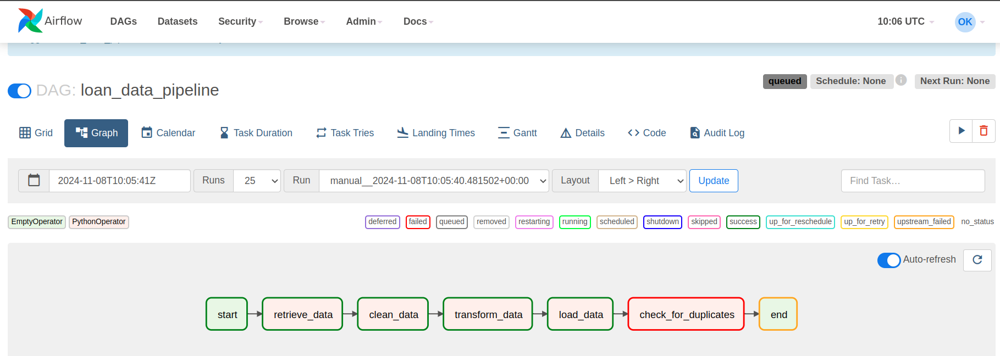

# Loan Data Pipeline

This project contains an Airflow DAG for processing loan data. The DAG is designed to perform data extraction, cleaning, transformation, loading, and a final data quality check on the processed data. The DAG workflow is visualized in the image below.



## Project Structure

- **dags/**: Contains the Airflow DAG file (`credit_analysis_dag.py`).
- **utils/**: Contains helper functions in `data_processing.py` for each task in the DAG.
- **output/**: Stores final processed files after the data pipeline completes.

## DAG Overview

The `loan_data_pipeline` DAG consists of the following tasks:

1. **retrieve_data**: 
   - Reads the raw loan data from a CSV file specified in `input_path`.
   - Saves the raw data to an intermediate file at `output_path`.

2. **clean_data**:
   - Cleans the raw data by performing the following steps:
     - Removes empty records.
     - Excludes records where `Current Loan Amount` is `99999999.0`, considered as placeholder values.
     - Adjusts the `Credit Score` column:
       - Divides by 10 if `Credit Score > 1000` and ends in `0`.
       - Removes records where `Credit Score > 1000` but does not end in `0`.
   - Saves the cleaned data to an intermediate file.

3. **transform_data**:
   - Splits the cleaned data into two tables: `customer_data` and `loan_data`.
   - `customer_data` contains selected fields with unique customer information.
   - `loan_data` retains all loan-related data.
   - Saves `customer_data` and `loan_data` as separate files.

4. **load_data**:
   - Loads the transformed customer and loan data from intermediate files.
   - Saves these final versions to the designated output paths.

5. **check_for_duplicates**:
   - Performs a data quality check to ensure there are no duplicate entries in the `Loan ID` column of the final `loan_data` file.
   - Raises an error if any duplicates are found in the `Loan ID` column, ensuring data integrity.

## DAG Workflow Diagram

The DAG workflow is illustrated below:


This pipeline is designed to ensure data quality and maintain the integrity of processed loan data, preparing it for further analysis or loading into a data warehouse.

---

## Setup

1. Ensure Airflow is set up and configured to run the DAG.
2. Place `credit_train.csv` in the specified input directory.
3. Run the DAG manually or configure it for periodic execution as needed.

## Requirements

- **Airflow**
- **Pandas**

To install the requirements:

```bash
pip install apache-airflow pandas
